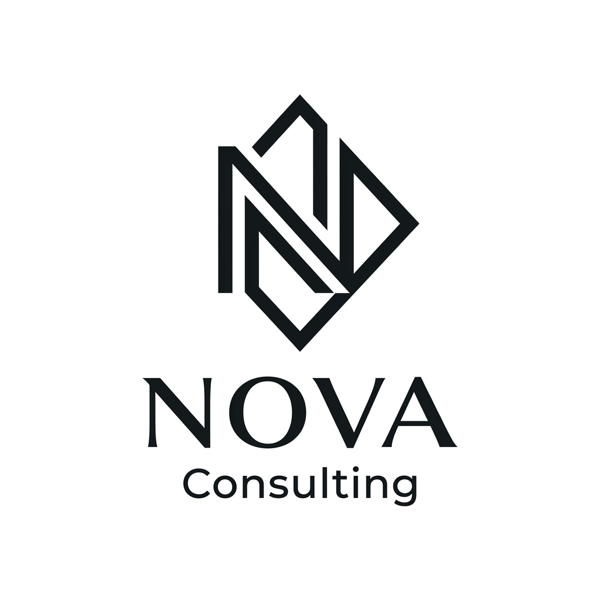

# NOVA Consulting — Company Profile Website

> Website company profile modern dan elegan untuk perusahaan konsultan profesional, dibangun dengan HTML, CSS, dan JavaScript murni tanpa framework.



## 🌐 Live Demo

🔗 **[novaconsulting-profile.github.io](https://your-username.github.io/sawala_project/)**

---

## 📋 Overview

NOVA Consulting adalah website company profile untuk perusahaan konsultan profesional fiktif. Website ini dirancang dengan tema **minimalis & elegan** (hitam-putih) menggunakan prinsip desain modern: tipografi premium, micro-animations, dan layout yang bersih.

Website ini dibuat sebagai submission untuk challenge frontend development dengan tema company profile yang informatif, responsif, dan estetis.

---

## ✨ Fitur Utama

| Fitur | Deskripsi |
|-------|-----------|
| 🎯 **Hero Section** | Animasi fade-up, statistik animasi counter, dan dekorasi geometris |
| 🏢 **About Us** | Profil perusahaan dengan value cards dan floating badge |
| ⚡ **Services** | 6 kartu layanan dengan efek hover animasi baris bawah |
| 📁 **Portfolio** | Filter interaktif berdasarkan kategori dengan animasi |
| 💬 **Testimonials** | Ulasan klien dengan rating bintang |
| 📰 **Blog** | 3 artikel preview di halaman utama + halaman blog lengkap |
| 📬 **Contact Form** | Form lengkap dengan validasi dan animasi sukses |
| 📱 **Responsive** | Mobile-first, berfungsi di semua ukuran layar |
| 🔝 **Back to Top** | Tombol scroll-to-top yang muncul saat scroll |
| 🧭 **Sticky Navbar** | Navbar transparan berubah saat scroll, dengan hamburger menu mobile |
| ✨ **Scroll Reveal** | Elemen muncul dengan animasi saat masuk viewport |

---

## 🛠️ Teknologi yang Digunakan

- **HTML5** — Struktur semantik dengan SEO-optimized markup
- **CSS3 (Vanilla)** — Custom Properties (design tokens), Grid, Flexbox, animations
- **JavaScript (ES6+)** — Intersection Observer API, counter animation, form handling
- **Google Fonts** — Playfair Display (serif) + Inter (sans-serif)
- **GitHub Pages** — Deployment gratis via GitHub Pages

---

## 🚀 Cara Menjalankan Project

### Secara Lokal

```bash
# 1. Clone repository
git clone https://github.com/your-username/sawala_project.git

# 2. Masuk ke direktori
cd sawala_project

# 3. Buka di browser
# Buka index.html langsung di browser, ATAU gunakan live server:
npx live-server .
```

Atau gunakan ekstensi **Live Server** di VS Code untuk hot-reload otomatis.

### Deployment ke GitHub Pages

```bash
# 1. Inisialisasi git (jika belum)
git init
git add .
git commit -m "Initial commit: NOVA Consulting website"

# 2. Push ke GitHub
git remote add origin https://github.com/your-username/sawala_project.git
git branch -M main
git push -u origin main

# 3. Aktifkan GitHub Pages
# GitHub repo → Settings → Pages → Source: Deploy from branch (main)
```

Website akan tersedia di: `https://your-username.github.io/sawala_project/`

---

## 📁 Struktur Folder

```
sawala_project/
├── index.html              # Halaman utama (Home)
├── README.md               # Dokumentasi project
│
├── assets/
│   ├── images/
│   │   └── logo.jpg        # Logo NOVA Consulting
│   └── icons/              # (reserved untuk ikon tambahan)
│
├── css/
│   └── style.css           # Stylesheet utama (design system + semua section)
│
├── js/
│   └── main.js             # JavaScript utama (interaktivitas & animasi)
│
└── pages/
    └── blog.html           # Halaman Blog lengkap dengan 3 artikel
```

---

## 🎨 Design System

| Token | Nilai |
|-------|-------|
| Primary Color | `#0a0a0a` (Near Black) |
| Background | `#ffffff` (White) |
| Alt Background | `#f5f5f5` (Off White) |
| Text Color | `#4a4a4a` (Dark Gray) |
| Accent | `#e8e8e8` (Light Gray) |
| Font Heading | Playfair Display (Serif) |
| Font Body | Inter (Sans-serif) |
| Border Radius | 4px / 8px / 16px |
| Max Width | 1200px |

---

## 🔧 Arsitektur & Flow

```
index.html
   │
   ├── css/style.css          ← Design tokens + all section styles
   │        └── @import Google Fonts
   │
   └── js/main.js             ← Interactivity layer
            ├── Navbar scroll + mobile toggle
            ├── Intersection Observer (scroll reveal)
            ├── Animated counters (hero stats)
            ├── Portfolio filter (kategori)
            ├── Contact form submission (simulated)
            └── Smooth anchor scrolling

pages/blog.html               ← Extended blog page
   ├── ../css/style.css       (shared styles)
   └── ../js/main.js          (shared scripts)
```

---

## 📸 Screenshot

### Hero Section


> Tampilan lengkap dapat dilihat di live demo.

---

## 📊 Section yang Tersedia

1. **Hero** — Tagline utama + statistik animasi + CTA
2. **About** — Profil perusahaan + nilai-nilai inti
3. **Services** — 6 layanan dengan hover effects
4. **Portfolio** — Proyek unggulan dengan filter kategori
5. **Testimonials** — Ulasan 3 klien
6. **Blog** — 3 artikel preview + link ke halaman blog
7. **Contact** — Info kontak + form interaktif
8. **Footer** — Navigasi + social links + copyright

---

## 🌟 Fitur Opsional yang Diimplementasi

- ✅ **Architecture Flow** — Diagram struktur di README
- ✅ **Screenshot fitur** — Di bagian README
- ✅ **Dokumentasi design system** — Tabel token desain
- ✅ **Structured folder** — Pemisahan CSS, JS, Pages, Assets

---

## 👨‍💻 Dibuat Oleh

**Tim NOVA Consulting Project**
- Framework: Vanilla HTML/CSS/JS
- Dibuat: September 2026

---

## 📄 Lisensi

MIT License — Bebas digunakan dan dimodifikasi dengan mencantumkan kredit.
